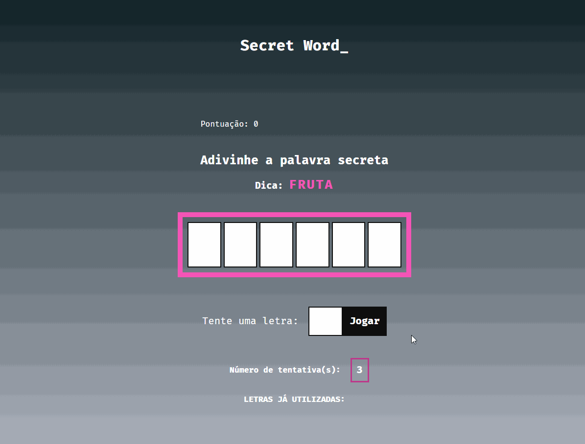

<h1 align="center">
  Secret Word_
</h1>

---

<p align="center">
  
  
  
</p>

<p align="center">* Status: Concluído ✅</p>

---

<p align="center">
  <a href="#sobre-o-projeto">Sobre</a> •
  <a href="#demonstração">Demonstração</a> • 
  <a href="#tecnologias-utilizadas">Tecnologias</a> •
  <a href="#dependências">Dependências</a> •
  <a href="#como-executar-o-projeto">Como executar</a> •
  <a href="#licença">Licença</a>
</p>

---

## 📑 Sobre o projeto

Secret Word é um projeto desenvolvido com ReactJS, que consiste em um mini-game onde o usuário precisa acertar a palavra que está escondida, tendo como dica apenas a própria dica da palavra e o número de letras que ela contém.
O projeto foi desenvolvido para treinar os primeiros conhecimentos em React, principalmente na utilização de JSX, React Hooks e Styled Components.

##### Como jogar:

- O usuário digita uma letra no input e clica em "jogar".
- Cada letra acertada é mostrada no seu espaço em branco correspondente da palavra secreta.
- A cada letra errada, o usário perde 1 tentativa (inicia com 3 tentativas).
- A cada palavra completa acertada, o usuário ganha 100 pontos.

---

## 🎨 Demonstração

<div align="center">
  
</div>

---

## 🚀 Tecnologias utilizadas

As seguintes ferramentas foram utilizadas no desenvolvimento do projeto:

- [**HTML**](https://html.com/)
- [**CSS**](https://www.w3.org/Style/CSS/)
- [**React**](https://reactjs.org/)
- [**NodeJS**](https://nodejs.org/en/)
- [**Visual Studio Code**](https://code.visualstudio.com/)

---

## 🧲 Dependências

- [x] **[ESLint](https://eslint.org/)**
- [x] **[Webpack](https://webpack.js.org/)**
- [x] **[Babel](https://babeljs.io/)**
- [x] **[ReactDOM](https://pt-br.reactjs.org/docs/react-dom.html)**
- [x] **[Styled Components](https://styled-components.com/)**

---

## 🛠️ Como executar o projeto

#### Pré-requisitos

Além de um <u>navegador de internet atualizado</u>, você precisa ter instalado em sua máquina as seguintes ferramentas: [Git](https://git-scm.com), [Node.js](https://nodejs.org/en/) e um editor de código como [VSCode](https://code.visualstudio.com/). Então, siga as instruções abaixo:

```bash
# Clone este repositório:
$ git clone https://github.com/leonarclo/secret-word.git

# Entre no diretório:
$ cd secret-word

# Visualizaçao:
$ npx liver-server

```

---

## 📝 Licença

Este projeto está licenciado sob a licença MIT. Para mais detalhes, acesse o arquivo [LICENSE.md](https://github.com/leonarclo/secret-word/blob/main/LICENSE).
